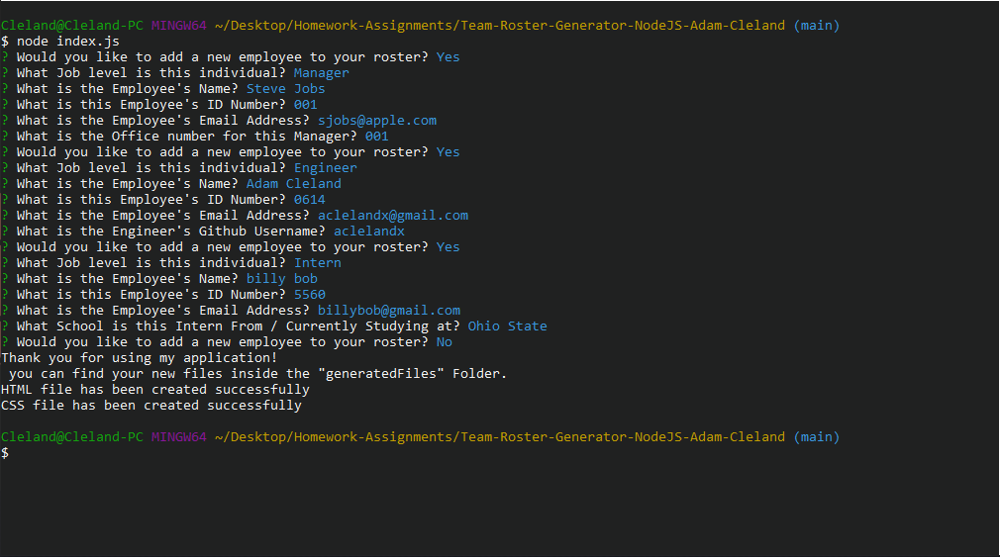
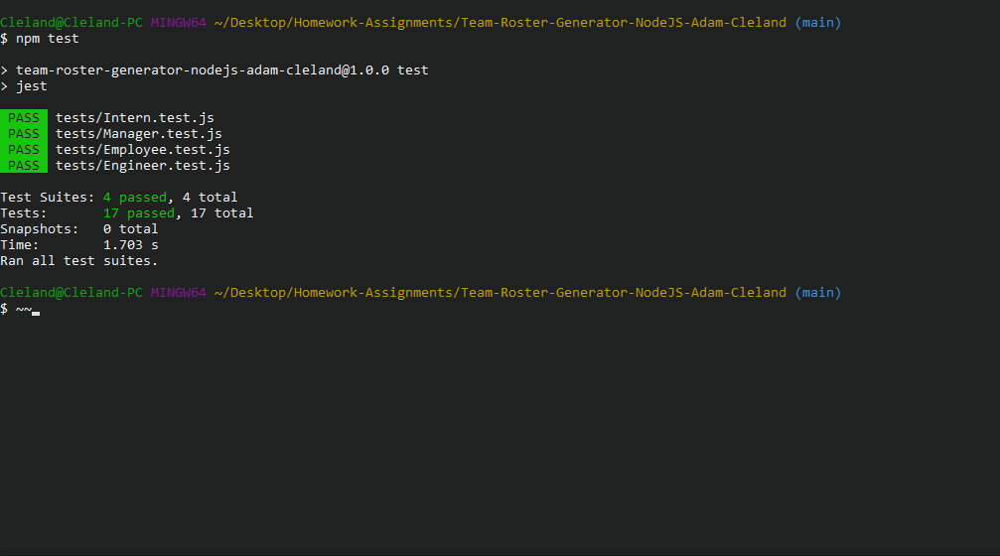
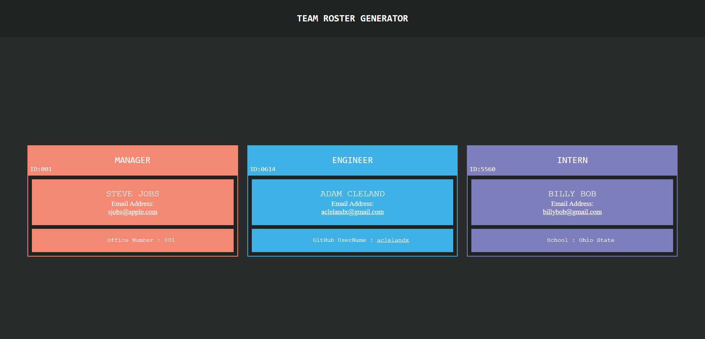

# Team-Roster-Generator-NodeJS-Adam-Cleland

### Description

We are tasked with creating a node.js command line application that takes in information about employees that are on a team / working at a company, then generates an HTML webpage that displays information cards for each person. This assignment is part of the OSU full-stack coding boot camp.

## Installation

---

Download the Repo and run on your Local machine.

       npm i // to install the required npm packages.

## Usage Information

---

##### To begin the program;

1. Navigate to the directory the application is located in through your terminal
2. Run `node index.js`
3. Fill out the question prompts.

##### Usage Video

<a href="https://drive.google.com/file/d/1npcbtlPs8JrNiFHO-riNtuhe4hRoe0ZT/view">Click me for a video demo of the Application</a>

## Tests

---

The command for running tests is :

        npm test

## ScreenShots

---

## Contributions

---

Pull requests are welcome. For major changes, please open an issue first to discuss what you would like to change.
(This project was part of an assignment for my full stack coding boot-camp; I will not be updating it unless it is required by my class).

## Questions

---

##### For Questions about the application Feel Free to Reach out to me on:

Github [aclelandx](https://github.com/aclelandx)

Email: <aclelandx@gmail.com>

## License

---

Copyright [2022] [Adam Cleland]

        Permission is hereby granted, free of charge, to any person obtaining a copy of this software and associated documentation files (the "Software"), to deal in the Software without restriction, including without limitation the rights to use, copy, modify, merge, publish, distribute, sublicense, and/or sell copies of the Software, and to permit persons to whom the Software is furnished to do so, subject to the following conditions:

        The above copyright notice and this permission notice shall be included in all copies or substantial portions of the Software.

        THE SOFTWARE IS PROVIDED "AS IS", WITHOUT WARRANTY OF ANY KIND, EXPRESS OR IMPLIED, INCLUDING BUT NOT LIMITED TO THE WARRANTIES OF MERCHANTABILITY, FITNESS FOR A PARTICULAR PURPOSE AND NONINFRINGEMENT. IN NO EVENT SHALL THE AUTHORS OR COPYRIGHT HOLDERS BE LIABLE FOR ANY CLAIM, DAMAGES OR OTHER LIABILITY, WHETHER IN AN ACTION OF CONTRACT, TORT OR OTHERWISE, ARISING FROM, OUT OF OR IN CONNECTION WITH THE SOFTWARE OR THE USE OR OTHER DEALINGS IN THE SOFTWARE.
